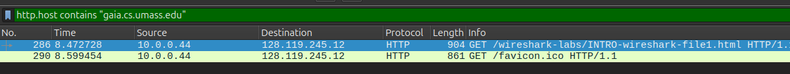

## ЛР 1
1. Какие из следующих протоколов показаны как
присутствующие (т.е. перечислены в столбце «protocol»
Wireshark) в вашем файле дампа: TCP, QUIC, HTTP, DNS, UDP,
TLSv1.2?

TCP
HTTP
TLSv1.2

2. Сколько времени прошло с момента отправки HTTP GET
сообщения до получения ответа HTTP OK?

8.501613 - 8.472728 = 0.028885 (просомтрел все http и ручками посчитал)

3.  Каков интернет-адрес gaia.cs.umass.edu (также известного
как www-net.cs.umass.edu)?

Dst: 128.119.245.12

 (destination IP)

4. Каков интернет-адрес вашего компьютера или (если вы
используете файл дампа) компьютера, который отправил HTTP
GET сообщение?

Source: 10.0.0.44

<<<После слайдов по фильтрма>>>

5. Вы захватили большой объем трафика. Какой фильтр нужно
применить, чтобы отобразить только DNS-запросы и ответы?
Напишите правильный синтаксис

 dns

6. Вам нужно проанализировать весь трафик,
которым обменивается ваш компьютер с адресом 192.168.1.5
и веб-сервером 93.184.216.34 (например, example.com).
Какой фильтр вы используете?

c) ip.addr == 192.168.1.5 and ip.addr == 93.184.216.34

7. В дампе трафика присутствует служебный протокол SSH (порт
22), который мешает анализу веб-трафика. Какой фильтр
скроет весь SSH-трафик, но покажет все остальное?

c) !(tcp.port == 22)  (сначала берет правило tcp.port == 22 (которое находит пакеты, где хотя бы один из портов равен 22), а затем not инвертирует весь результат)

8. Вы подозреваете, что на компьютере в вашей сети работает
нелегальный FTP-сервер. FTP использует порт 21 для
управления и порты 20 для данных (active mode). Какой фильтр
поможет найти весь трафик, относящийся к FTP?

9. Вы подозреваете, что на компьютере в вашей сети работает
   нелегальный FTP-сервер. FTP использует порт 21 для
   управления и порты 20 для данных (active mode). Какой фильтр
   поможет найти весь трафик, относящийся к FTP?

   c) tcp.port == 20 or tcp.port == 21

10. Вы обнаружили подозрительный HTTP-запрос на незнакомый сайт.
    Чтобы проанализировать всю сессию (все запросы и ответы)
    между вашим компьютером и этим сайтом, нужно отфильтровать
    трафик по номеру TCP-порта источника и назначения. Какой
    фильтр будет правильным, если IP вашего компьютера —
    192.168.1.10, а IP сервера — 10.10.10.10, и вы установили, что
    связь шла через порт 54321 вашего ПК и порт 80 сервера?

    • c) (ip.addr == 192.168.1.10 and tcp.port == 54321) and (ip.addr ==
    10.10.10.10 and tcp.port == 80)
